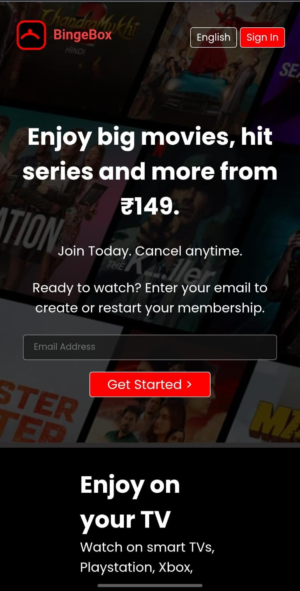

[](LICENSE) 
[](https://developer.mozilla.org/en-US/docs/Web/HTML)
[](https://developer.mozilla.org/en-US/docs/Web/CSS)

# Streaming UI Using HTML And CSS

## 📺 Project Description

BingeBox is a responsive streaming service homepage built with **HTML & CSS**.  
It demonstrates hover effects, responsive layouts for mobile/tablet/desktop, and includes a custom SVG logo & favicon.  
**Live Demo:** [Click here](https://sarthakaloria.github.io/Streaming-UI-Using-HTML-And-CSS/)


**Key Details:**
- **Tech Stack:** HTML5, CSS3, SVG  
- **Responsive Design:** Mobile, Tablet, Desktop breakpoints  
- **Interactive Features:** Hover effects on posters and navigation items  
- **Assets:** Custom SVG logo and favicon optimized for dark background  
- **No JS Frameworks:** Pure HTML & CSS  
- **Purpose:** Learning front-end layout, responsive design, and micro-interactions

---
## Table of Contents

- [Features](#features)  
- [Usage](#usage)  
- [Results](#results)  
- [Tech Stack](#tech-stack)  
- [Contributing](#contributing)  
- [Authors](#authors)  
- [License](#license)  
- [Acknowledgements](#acknowledgements)  
- [Support](#support)

---
## ✨ Features

- Responsive layout for **mobile, tablet, and desktop**
- **Hover effects** on posters, buttons, and navigation items
- **Custom SVG logo** and **favicon** optimized for dark backgrounds
- Pure **HTML & CSS**, no JavaScript frameworks
- **Semantic HTML** structure with accessible elements
- Easily extendable for additional sections like carousels or watchlists
- Optimized for **learning front-end fundamentals** and micro-interactions


---
## 🚀 Usage

Once the homepage is open (locally or via GitHub Pages):

- Navigate through the **header menu** to see hover effects on navigation items.  
- Scroll down to browse **movie/show posters** and see **hover effects** on images.  
- The layout **adapts** automatically for mobile, tablet, and desktop screen sizes.  
- Observe the **custom SVG logo** and **favicon** designed for a dark background.  
- You can use this project as a **template** for learning responsive design or building your own streaming UI.

> Tip: Open the page in **different devices or browser widths** to test responsiveness.

---
## 📊 Results

The homepage displays a clean, responsive streaming UI with the following highlights:

- **Responsive Layout:** Works on mobile, tablet, and desktop.  
- **Hover Effects:** Interactive hover animations on posters and navigation items.  
- **Custom Branding:** Custom SVG logo and favicon optimized for dark backgrounds.  
- **Dark-Themed UI:** High contrast with black background and red accents for a modern look.  

### Screenshots

Desktop view:


Mobile view:


> You can view the **live demo** here: [Click here](https://sarthakaloria.github.io/Streaming-UI-Using-HTML-And-CSS/)


---
## 🛠 Tech Stack

- **HTML5** — semantic markup for the homepage structure  
- **CSS3** — styling, responsive layouts, and hover effects  
- **SVG** — custom logo and favicon graphics  
- **Git & GitHub** — version control and hosting via GitHub Pages  
- **Browser Compatibility** — tested on Chrome, Firefox, Edge  

---
## 🤝 Contributing


Contributions are welcome! Whether it’s fixing bugs, improving responsiveness, or adding new UI components, you can help improve this project.

### How to Contribute

1. **Fork the repository**  
2. **Clone your fork** locally:
```bash
git clone https://github.com/your-username/Streaming-UI-Using-HTML-And-CSS.git
```
3. **Create a new branch for your feature or bugfix**:
```bash
git checkout -b feature/your-feature-name
```
4. **Make your changes (HTML/CSS updates)**
5. **Commit your changes**:
```bash
git commit -m "Add: brief description of changes"

```
6. **Push your branch**:
```bash
git push origin feature/your-feature-name
```
7. **Open a Pull Request on the main repository.**
```bash

### Notes:
- Use **“Contributing”** as the header — that’s the standard convention on GitHub.  
- Even a note like “This is a beginner-friendly project; all contributions welcome” can help attract collaborators.  
- Later, if you want, you can also link to a **CONTRIBUTING.md** file for detailed rules.  

```
---
## Authors

- **Sarthak Aloria** – [SarthakAloria](https://github.com/SarthakAloria)


---
## 🙏 Acknowledgements

I would like to thank the following resources for helping me build this project:

- [MDN Web Docs](https://developer.mozilla.org/) — for HTML & CSS references  
- [Shields.io](https://shields.io/) — for creating badges  
- [Readme.so](https://readme.so/) — for structuring the README  
- [SVG Logo Inspiration](https://www.svgrepo.com/) — for designing the custom logo  
- Netflix — for UI/UX design inspiration (for educational purposes only)  

---
## Support

For any issues or feature requests, please open an issue on GitHub or contact me at sarthakaloria27@gmail.com.

---